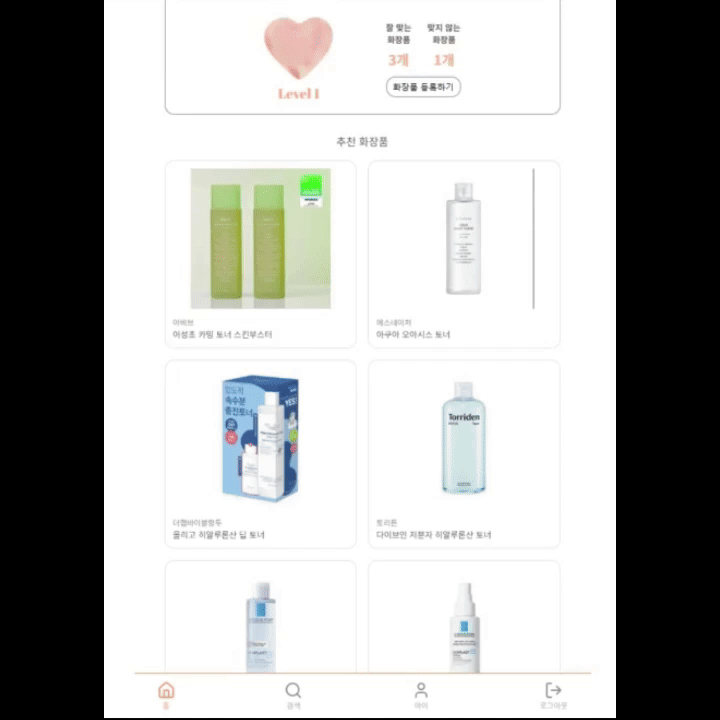
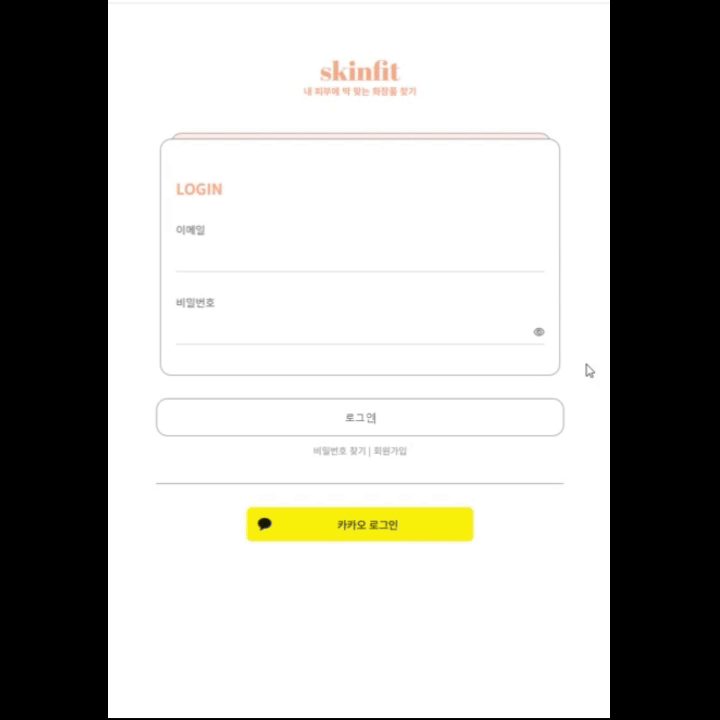

# 목차
1. [기획 배경](#기획-배경)
3. [목적](#목적)
4. [데이터 수집](#데이터-수집)
5. [주요기능 및 기술](#주요기능-및-기술)
6. [화면소개](#화면소개)
7. [서비스 아키텍처](#서비스-아키텍처)
8. [ERD](#ERD) 
9. [명세서(기능, API, 요구사항)](#명세서: 기능-api-요구사항)
10. [화면 정의서](#화면-정의서)
11. [담당 역할](#담당-역할)
---

# SkinFit : 내 피부에 딱 맞는 화장품 찾기
사용자별 민감 성분 분석 기반 AI 화장품 추천 플랫폼

## 개발 기간
2025.01.13~2025.02.21(6주)

## 기획배경
1. 화장품(기초제품) 구매시 내 피부에 맞지 않는 성분을 파악할 서비스가 시중에 없다는 것이 아쉬움
2. 직접 20-30대 대상 설문 진행(74명) : 50%가 구매 전 성분을 확인하지만 93%가 자신에게 민감한 성분을 모름, 73%가 피부 이상을 경험

## 목적
1. 나에게 맞지 않는 민감 성분을 찾아주고
2. 화장품 구매 전 해당 성분의 포함 여부 알 수 있게 하여
3. 수많은 정보 속 사용자의 고민 시간을 줄이고, 일상에 윤택함을 더한다

## 데이터 수집
1. 총 약 8만 3천개의 화장품 - 성분 매칭 데이터 확보
2. 약 2만 1천 3백개의 성분 데이터와 3만개의 성분 데이터(피부연구 기관: 美 EWG, 韓 폴라초이스) 수집
3. 올리브영 및 기타 화장품 사이트 크롤링한 약 2천 4백개의 화장품 데이터 수집

## 주요기능 및 기술
1. 사용자별 민감성분 분석 및 진단
     
    

2. AI 기반 사용자 맞춤 화장품 추천
     
     
     

3. OCR 기반 간편한 화장품 등록
     
    

## 화면소개
1. 회원정보 입력 페이지
   1) 성별, 출생연도, 닉네임, 피부타입(지성, 건성, 중성, 복합성, 민감성)
   2) 나에게 잘 맞는 / 안맞는 화장품 검색 후 등록(필수)
   3) 나에게 잘 맞는 / 안맞는 성분 검색 후 등록(선택)
    

2. 메인페이지
   1) 제품 검색바 제공
   2) 피부 분석 정확도 시각화
   3) 추천 화장품 목록 제공
   

3. 화장품 검색 페이지
   1) 상품명 또는 브랜드명 입력
   2) 디바운싱 기반 연관검색어 제공
   3) 카테고리별(스킨, 토너, 바디 등) / 잘 맞는 화장품만 필터링 검색
   4) 안전 / 유의 뱃지로 잘 맞는 화장품 시각화
    
   

4. 상세 페이지
   1) 사용자에게 민감한 성분 정보 제공
   2) 전성분 안전 등급 제공 (美EWG 피부연구기관 데이터 기반)
    
    
   
   3) 좋아요순 / 최신순, 내피부 맞춤 리뷰 필터링 기능
   4) 리뷰 등록 및 신고 기능
   

5. 마이페이지
   1) 나와 맞지 않는 성분 랭킹 제공
   2) 내가 등록한 화장품 / 성분 정보 제공 및 수정 기능
   3) 내가 등록한 / 좋아요한 리뷰 제공
   4) 회원정보(피부타입, 닉네임, 비밀번호) 수정 기능

6. OCR 기반 화장품 등록 요청
   1) 상품명, 브랜드명 등 화장품 관련 정보 입력
   2) 화장품 뒷면 전성분 사진 등록
    

7. 관리자 페이지
   1) 신고 리뷰 관리
   2) 요청된 화장품 정보 검수 및 등록
   

8. 로딩 및 소개 화면
   1) 3 페이지에 걸쳐 주요 기능 3가지 소개
    

## 서비스 아키텍처

## ERD

## 명세서(기능, API, 요구사항)

## 화면 정의서

## 담당 역할

| 이름 | 역할 | 담당 업무 |
| --- | --- | --- |
| 김의중 | BE, Infra | - Spring Security, JWT, OAuth를 이용해 소셜로그인 및 회원가입 구현 (인증, 인가) - 회원 마이페이지 CRUD 기능 구현 - JPA를 이용하여 API 개발 - Redis를 이용하여 인증토큰 관리 및 추천화장품, 성분분석정보 캐싱 - EC2, Jenkins, Dokcer, Nginx, GitLab을 이용하여 무중단 배포서버 구축 - 인증서를 이용하여 https 구현 - Nginx로 리버스프록시 사용 (/api, /, /recommend, /ocr) - 스프링부트 서버에서 성분 분석 알고리즘 구현 |
| 김세림 | BE, Data | - BeautifulSoup, Selenium을 이용한 화장품 데이터 크롤링 - 화장품 성분 및 평점 데이터 수집 - 성분명 전처리 진행 - DB 초기 데이터 정제 및 AWS S3 이미지 url 연동 - 리뷰 페이지 CRUD 구현 - AWS S3을 이용한 이미지 업로드 기능 구현 |
| 오한나 | FE | - 서비스 디자인(Figma) - 메인페이지, 상품 상세 페이지, 리뷰 등록, 소개 페이지 구현 - 검색 팝업창(화장품/성분 등록/수정 기능) 구현 - 리뷰 등록, OCR, 관리자페이지에서 사용하는 이미지 업로드, 미리보기 컴포넌트 구현 - 회원정보폼 구현 마무리 - css 초기 설정 및 반응형 설정 |
| 이태우 | BE | - 서비스 디자인(Figma) - JPA를 이용하여 API 개발 - 스프링부트 서버에서 검색 정렬 알고리즘 구현 - 디바운싱 기반 화장품과 성분명 자동 완성 알고리즘 구현 - 화장품 상세 페이지 |
| 전혜준 | FE | - Zustand 전역 상태 관리 시스템 구축 - TanStack Query와 Axios 기반 비동기 데이터 처리 - 검색 기능 구현(디바운싱 기반 연관 검색어, 필터링 검색) - 마이페이지, 회원정보폼, OCR 등록 페이지 - 리뷰 좋아요 CRUD 기능 구현 - SCSS와 CSS Keyframes 활용한 인터랙티브 UI/UX 개발 - Figma 화면정의서 & API 명세서 지속적 업데이트 |
| 황대규 | BE, FE, Data | - 로그인, 회원가입, 초기 회원 정보 입력 폼 페이지 구현 - 관리자 신고 받은 리뷰 확인 및 ocr 기반 화장품 등록 페이지 구현 - 관리자 페이지 CRUD 구현 - clova ocr모델과 open ai api를 활용, ocr 데이터 처리 - 코사인 유사도, 하이브리드 추천 시스템을 활용한 추천 알고리즘 구현 |
